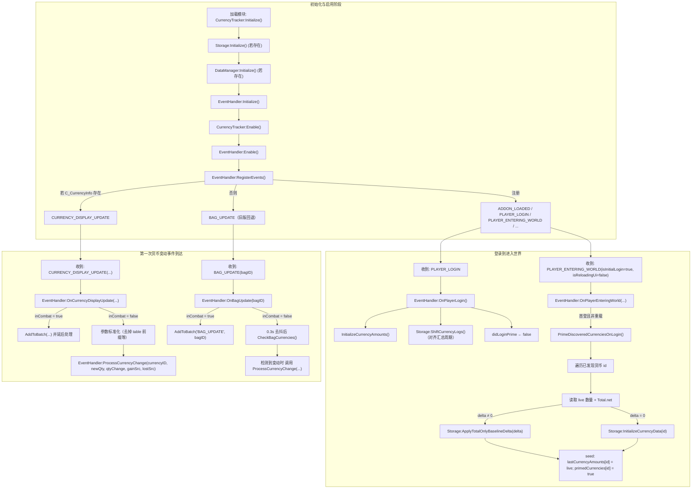

```mermaid
flowchart TD
  %% 子图：模块初始化与启用
  subgraph INIT["初始化与启用阶段"]
    A1["加载模块: CurrencyTracker:Initialize()"] --> A2["Storage:Initialize() (若存在)"]
    A2 --> A3["DataManager:Initialize() (若存在)"]
    A3 --> A4["EventHandler:Initialize()"]
    A4 --> A5["CurrencyTracker:Enable()"]
    A5 --> A6["EventHandler:Enable()"]
    A6 --> A7["EventHandler:RegisterEvents()"]
    A7 -->|注册| A7a["ADDON_LOADED / PLAYER_LOGIN / PLAYER_ENTERING_WORLD / ..."]
    A7 -->|若 C_CurrencyInfo 存在| A7b["CURRENCY_DISPLAY_UPDATE"]
    A7 -->|否则| A7c["BAG_UPDATE（旧版回退）"]
  end

  %% 子图：登录阶段（直到世界载入完毕）
  subgraph LOGIN["登录到进入世界"]
    B1["收到: PLAYER_LOGIN"] --> B2["EventHandler:OnPlayerLogin()"]
    B2 --> B2a["InitializeCurrencyAmounts()"]
    B2 --> B2b["Storage:ShiftCurrencyLogs()（对齐汇总周期）"]
    B2 --> B2c["didLoginPrime ← false"]

    B3["收到: PLAYER_ENTERING_WORLD(isInitialLogin=true, isReloadingUi=false)"] --> B4["EventHandler:OnPlayerEnteringWorld(...)"]
    B4 -->|首登且非重载| B5["PrimeDiscoveredCurrenciesOnLogin()"]
    B5 --> B5a["遍历已发现货币 id"]
    B5a --> B5b["读取 live 数量 + Total.net"]
    B5b -->|delta ≠ 0| B5c["Storage:ApplyTotalOnlyBaselineDelta(delta)"]
    B5b -->|delta = 0| B5d["Storage:InitializeCurrencyData(id)"]
    B5c --> B5e["seed: lastCurrencyAmounts[id] = live; primedCurrencies[id] = true"]
    B5d --> B5e
  end

  %% 子图：第一次货币变动事件
  subgraph FIRST_EVENT["第一次货币变动事件到达"]
    C1["收到: CURRENCY_DISPLAY_UPDATE(...)"] --> C2["EventHandler:OnCurrencyDisplayUpdate(...)"]
    C2 -->|inCombat = true| C2a["AddToBatch(...) 并延后处理"]
    C2 -->|inCombat = false| C3["参数标准化（去掉 table 前缀等）"]
    C3 --> C4["EventHandler:ProcessCurrencyChange(currencyID, newQty, qtyChange, gainSrc, lostSrc)"]

    %% 旧版回退路径
    D1["收到: BAG_UPDATE(bagID)"] --> D2["EventHandler:OnBagUpdate(bagID)"]
    D2 -->|inCombat = true| D2a["AddToBatch('BAG_UPDATE', bagID)"]
    D2 -->|inCombat = false| D3["0.3s 去抖后 CheckBagCurrencies()"]
    D3 --> D4["检测到变动时 调用 ProcessCurrencyChange(...)"]
  end

  %% 连接阶段
  A7a --> B1
  A7a --> B3
  A7b --> C1
  A7c --> D1
```